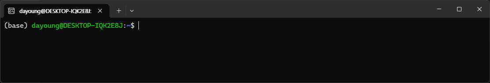
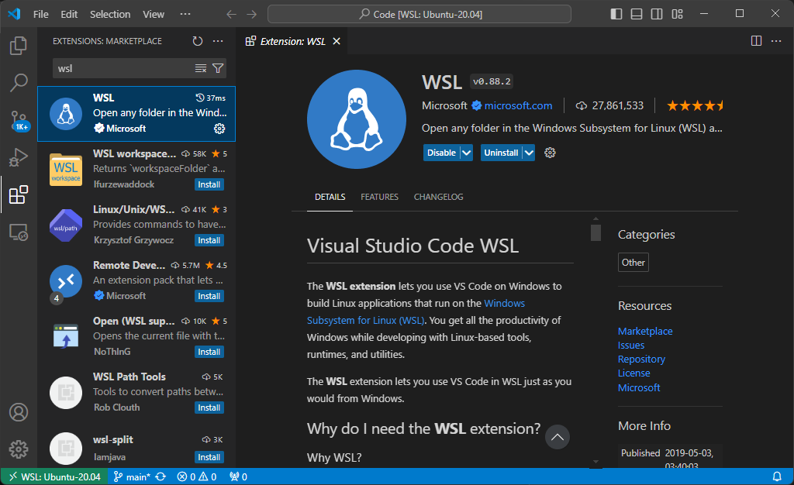
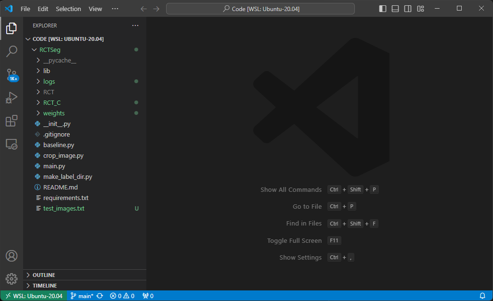

# Install WSL in Window11

## 1. Install Ubuntu
run PowerShell as administrator and install ubuntu

```shell
wsl --install -d Ubuntu-20.04
```

now, you can use ubuntu with CUI(ubuntu lts app)



## 2. Using Ubuntu with VSCode
### vscode
install extension ```WSL```



### ubuntu
1. ```sudo apt-get update```
2. ```sudo apt-get install wget ca-certificates```
3. ```cd wanted_dir```
4. ```code .``` &rarr; vscode automatically starts 


