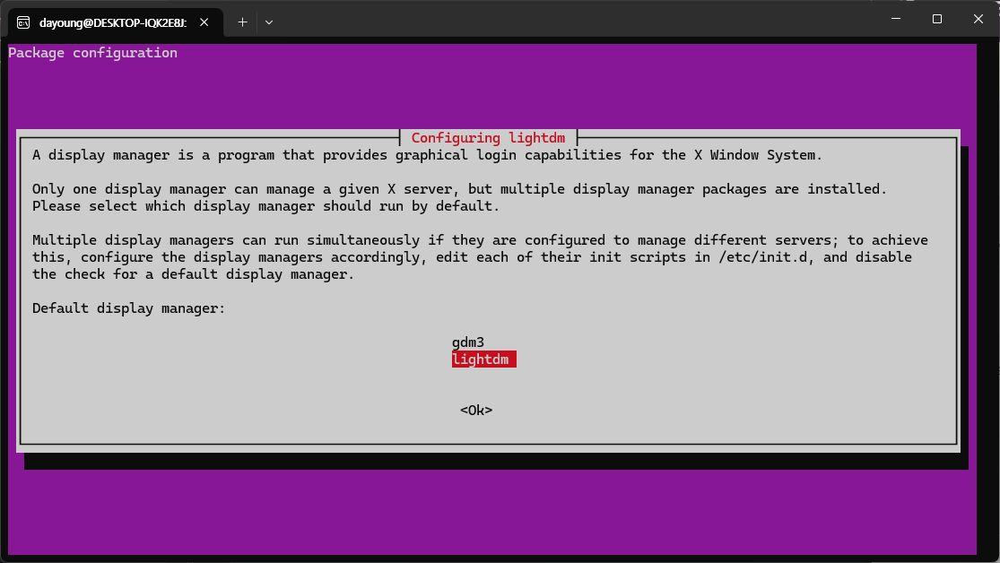
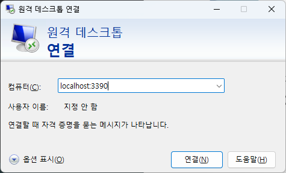
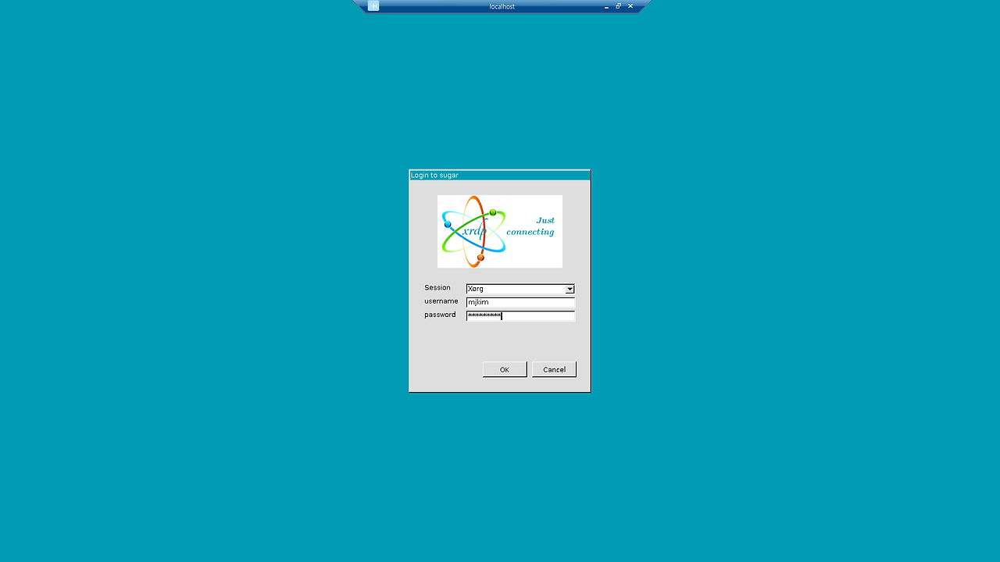
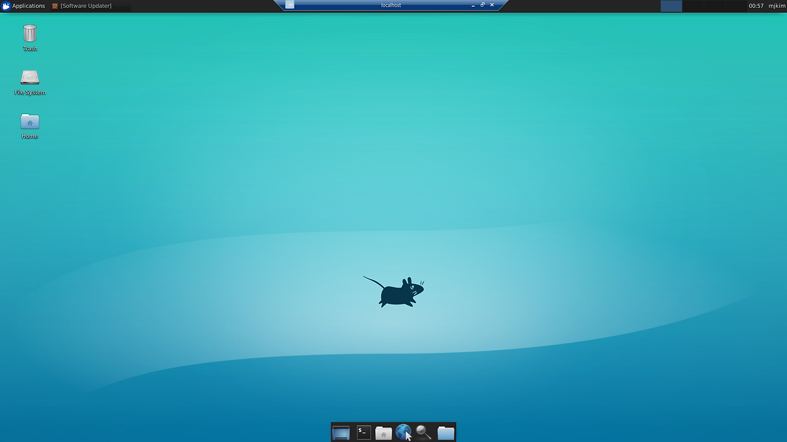

# Install WSL in Window11

## 1. Install Ubuntu
run PowerShell as administrator and install ubuntu

- if wsl not installed on your computer
    ```shell
    wsl --install
    ```
- else to get specific version
    ```shell
    wsl --install -d Ubuntu-20.04
    ```

now, you can use ubuntu with CUI(ubuntu lts app)

## 2. Using Ubuntu with GUI
run Ubuntu and install packages

### ubuntu desktop
```shell
sudo apt update && apt -y upgrade
sudo apt install -y ubuntu-desktop
```

###  xfce4 & xrdp 

```shell
sudo apt -y install xfce4
```



```shell
sudo apt-get install xrdp
sudo cp /etc/xrdp/xrdp.ini /etc/xrdp/xrdp.ini.bak
sudo sed -i 's/3389/3390/g' /etc/xrdp/xrdp.ini
sudo sed -i 's/max_bpp=32/#max_bpp=32nmax_bpp=128/g' /etc/xrdp/xrdp.ini
sudo sed -i 's/xserverbpp=24/#xserverbpp=24nxserverbpp=128/g' /etc/xrdp/xrdp.ini

# activate xrdp
sudo /etc/init.d/xrdp start
```

### connect remote desktop





