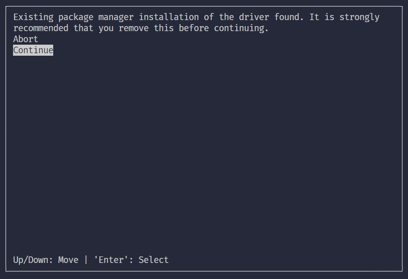
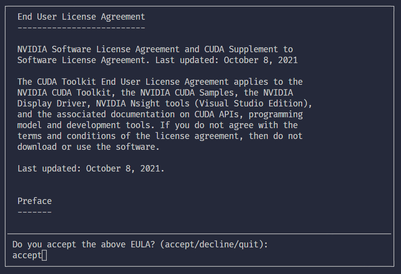
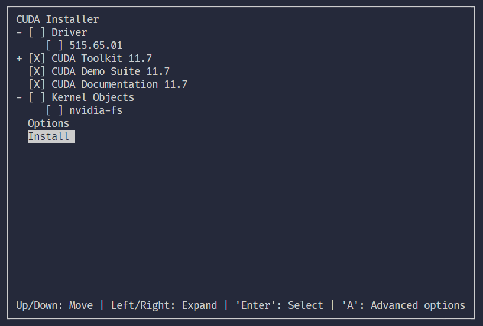

# Installing PyTorch and Tensorflow with CUDA, cuDDN

- Ubuntu 20.04 version
- Anaconda must be installed

## NVIDIA driver
1. download driver(select your type): [https://www.nvidia.com/Download/index.aspx](https://www.nvidia.com/Download/index.aspx)
   - RTX 4070 Ti SUPER
   - Linux 64bit

2. make authorization
```shell
chmod +x ./NVIDIA-Linux-x86_64-550.78.run
```

3. install
```shell
sudo sh ./NVIDIA-Linux-x86_64-550.78.run
```

## CUDA
1. download cuda-11.8
```shell
wget https://developer.download.nvidia.com/compute/cuda/11.8.0/local_installers/cuda_11.8.0_520.61.05_linux.run
```

2. install
```shell
sudo sh cuda_11.8.0_520.61.05_linux.run
```

**make sure uncheck ```Driver``` below**





3. setting path
```shell
sudo nano ~/.bashrc
```

on the bottom line, enter the following two lines of code

```shell
export PATH="/usr/local/cuda-11.8/bin:$PATH"
export LD_LIBRARY_PATH="/usr/local/cuda-11.8/lib64:$LD_LIBRARY_PATH"
```

apply setting
```shell
source ~/.bashrc
```

4. check
```shell
nvcc -V
```

result
```
nvcc: NVIDIA (R) Cuda compiler driver
Copyright (c) 2005-2022 NVIDIA Corporation
Built on Wed_Sep_21_10:33:58_PDT_2022
Cuda compilation tools, release 11.8, V11.8.89
Build cuda_11.8.r11.8/compiler.31833905_0
```

## cuDDN
1. download(select CUDA version): [https://developer.nvidia.com/rdp/cudnn-archive](https://developer.nvidia.com/rdp/cudnn-archive) - Download cuDNN v8.6.0   (October 3rd, 2022), for CUDA 11.x

2. unzip
```shell
tar -xvf cudnn-linux-x86_64-8.6.0.163_cuda11-archive.tar.xz
```

3. setting path
```shell
sudo cp cudnn-linux-x86_64-8.6.0.163_cuda11-archive/include/cudnn*.h /usr/local/cuda-11.8/include
```

```shell
sudo cp cudnn-linux-x86_64-8.6.0.163_cuda11-archive/lib/libcudnn* /usr/local/cuda-11.8/lib64
```

```shell
sudo chmod a+r /usr/local/cuda-11.8/include/cudnn*.h /usr/local/cuda-11.8/lib64/libcudnn*
```

4. check
```shell
cat /usr/local/cuda/include/cudnn_version.h | grep CUDNN_MAJOR -A 2
```

result
```shell
#define CUDNN_MAJOR 8
#define CUDNN_MINOR 6
#define CUDNN_PATCHLEVEL 0
```

## PyTorch
1. install with conda
```shell
conda install pytorch torchvision torchaudio pytorch-cuda=11.8 -c pytorch -c nvidia
```

2. check
```shell
python

>> import torch
>> print(torch.cuda.is_available())
   True
>> print(torch.cuda.device_count())
   1
>> print(torch.cuda.get_device_name(torch.cuda.current_device()))
   NVIDIA GeForce RTX 4070 Ti SUPER
```

## Tensorflow
1. create conda
   ```shell
   conda create -n <env-name> python=3.8
   ```
   
2. install with pip
   ```shell
   pip install tensorflow==2.12
   ```

3. check
   ```shell
   python

   >> from tensorflow.python.client import device_lib
   >> device_lib.list_local_devices()
      [name: "/device:CPU:0"
      device_type: "CPU"
      memory_limit: 268435456
      locality {
      }
      incarnation: 2737954448086927755
      xla_global_id: -1
      , name: "/device:GPU:0"
      device_type: "GPU"
      memory_limit: 14345699328
      locality {
        bus_id: 1
        links {
        }
      }
      incarnation: 6898625890745723943
      physical_device_desc: "device: 0, name: NVIDIA GeForce RTX 4070 Ti SUPER, pci bus id: 0000:0a:00.0, compute capability: 8.9"
      xla_global_id: 416903419
      ]
   ```
   
