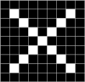
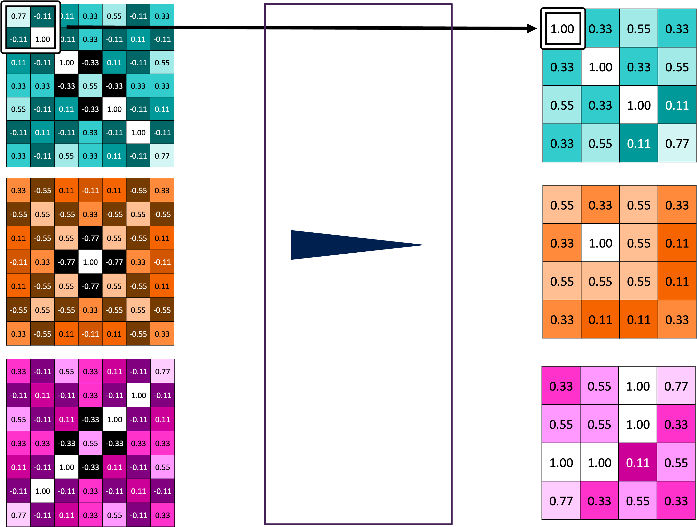

# CNN: Convolutional Neural Network

Let's start by understanding how a Convolutional GNN works with ```X``` and ```O``` classifier.



First, let's consider this image and determine how can we classify it as an X. 
CNNs compare images ```piece by piece```, extracting features that represent the image well.

In this image, the 3x3 feature can be represented as follows:


This is the important part that shows this image is an ```X```.

## Convolution

Using this feature as a filter, we convolve it with the image, ```calculating the average``` and placing it at the center.


If we calculate the feature map for the entire features, the resulting image will look like this:


## Pooling
Pooling methods like max-pooling, average-pooling, min-pooling, and sum-pooling are used to condense the feature. Here, i use ```max-pooling```.
In a **2x2 grid**, we select the largest value. This pooling operation is applied to all the feature maps.



## ReLU(Rectified Linear Units)
ReLU is activation function wherever a negative number occurs, it is ```swapped out for a 0```. 
This helps the CNN stay **mathematically stable** by preventing learned values from getting stuck near 0 or blowing up toward infinity.


## Stacking
Layers can be repeated several (or many) times. In this case, let's stack ```conv > relu > conv > relu > max-pool > conv> relu > max-pool```


## Fully Connected Layer


Instead of treating inputs as a two-dimensional array, they are treated as a single list, and all values are treated identically. 
Every value gets its ```own vote``` on whether the current image is an X or O to classify.

## Code

I implemented my own CNN model by stacking layers in the following order: ```conv > relu > conv > relu > max-pool > fully connected ```.
This model was designed to classify ```X``` and ```O```, used linear regression to predict.


I emailed to ```Brandon Rohrer```([How Convolutional Neural Networks work](https://www.youtube.com/watch?v=FmpDIaiMIeA)) to verify its correctness, and he confirmed that it was correct!


```python
import numpy as np
from sklearn.linear_model import LogisticRegression

# =========================================
# Convolution
# =========================================
def convolution(input_arr, kernel):
    input_shape = input_arr.shape

    output_shape = (input_shape[0] - kernel.shape[0] + 1, input_shape[1] - kernel.shape[1] + 1)
    output_arr = np.zeros(output_shape)

    for i in range(output_shape[0]):
        for j in range(output_shape[1]):
            output_arr[i, j] = np.sum(input_arr[i:i + kernel.shape[0], j:j + kernel.shape[1]] * kernel) / 9

    return output_arr


# =========================================
# ReLU
# =========================================
def relu(x):
    return np.maximum(0, x)


# =========================================
# Pooling
# =========================================
def max_pooling(input_arr):
    input_shape = input_arr.shape
    output_shape = (input_shape[0] // 2 + input_shape[0] % 2, input_shape[1] // 2 + input_shape[1] % 2)
    output_arr = np.zeros(output_shape)

    for i in range(output_shape[0]):
        for j in range(output_shape[1]):
            row_start = i * 2
            row_end = min(row_start + 2, input_shape[0])
            col_start = j * 2
            col_end = min(col_start + 2, input_shape[1])
            output_arr[i, j] = np.max(input_arr[row_start:row_end, col_start:col_end])

    return output_arr


# =========================================
# Layer Stacking
# =========================================
def layer_stacking(input_arr, kernels):

    stacked_layers = []
    for kernel in kernels:
        # 1. Convolution
        con_kernel = convolution(input_arr, kernel)
        # 2. ReLU
        relu_con_kernel = relu(con_kernel)
        # 3. Convolution
        con_relu_con_kernel = convolution(relu_con_kernel, kernel)
        # 4. ReLU
        relu_con_relu_con_kernel = relu(con_relu_con_kernel)
        # 5. Pooling
        pool_relu_con_relu_con_kernel = max_pooling(relu_con_relu_con_kernel)
        # 6. Flatten
        flatten_layer = pool_relu_con_relu_con_kernel.flatten()

        stacked_layers.append(flatten_layer)

    return np.concatenate(stacked_layers)


def main():
    # =========================================
    # Define image "X"
    # =========================================

    x_1 = np.array([[-1, -1, -1, -1, -1, -1, -1, -1, -1],
                    [-1, 1, -1, -1, -1, -1, -1, 1, -1],
                    [-1, -1, 1, -1, -1, -1, 1, -1, -1],
                    [-1, -1, -1, 1, -1, 1, -1, -1, -1],
                    [-1, -1, -1, -1, 1, -1, -1, -1, -1],
                    [-1, -1, -1, 1, -1, 1, -1, -1, -1],
                    [-1, -1, 1, -1, -1, -1, 1, -1, -1],
                    [-1, 1, -1, -1, -1, -1, -1, 1, -1],
                    [-1, -1, -1, -1, -1, -1, -1, -1, -1]])

    x_2 = np.array([[-1, -1, -1, -1, -1, -1, -1, -1, -1],
                    [-1, -1, -1, -1, -1, -1, -1, -1, -1],
                    [-1, -1, -1, -1, -1, -1, -1, -1, -1],
                    [-1, -1, -1, 1, -1, 1, -1, -1, -1],
                    [-1, -1, -1, -1, 1, -1, -1, -1, -1],
                    [-1, -1, -1, 1, -1, 1, -1, -1, -1],
                    [-1, -1, -1, -1, -1, -1, -1, -1, -1],
                    [-1, -1, -1, -1, -1, -1, -1, -1, -1],
                    [-1, -1, -1, -1, -1, -1, -1, -1, -1]])

    x_3 = np.array([[-1, -1, -1, -1, -1, -1, -1, -1, -1],
                    [-1, -1, -1, -1, -1, -1, -1, -1, -1],
                    [-1, -1, 1, -1, -1, -1, 1, -1, -1],
                    [-1, -1, -1, 1, -1, 1, -1, -1, -1],
                    [-1, -1, -1, -1, 1, -1, -1, -1, -1],
                    [-1, -1, -1, 1, -1, 1, -1, -1, -1],
                    [-1, -1, 1, -1, -1, -1, 1, -1, -1],
                    [-1, -1, -1, -1, -1, -1, -1, -1, -1],
                    [-1, -1, -1, -1, -1, -1, -1, -1, -1]])

    x_kernels = [
        np.array([[1, -1, -1],
                  [-1, 1, -1],
                  [-1, -1, 1]]),
        np.array([[1, -1, 1],
                  [-1, 1, -1],
                  [1, -1, 1]]),
        np.array([[-1, -1, 1],
                  [-1, 1, -1],
                  [1, -1, -1]])
    ]


    # =========================================
    # Define image "Square"
    # =========================================

    s_1 = np.array([[-1, -1, -1, -1, -1, -1, -1, -1, -1],
                    [-1, 1, 1, 1, 1, 1, 1, 1, -1],
                    [-1, 1, -1, -1, -1, -1, -1, 1, -1],
                    [-1, 1, -1, -1, -1, -1, -1, 1, -1],
                    [-1, 1, -1, -1, -1, -1, -1, 1, -1],
                    [-1, 1, -1, -1, -1, -1, -1, 1, -1],
                    [-1, 1, -1, -1, -1, -1, -1, 1, -1],
                    [-1, 1, 1, 1, 1, 1, 1, 1, -1],
                    [-1, -1, -1, -1, -1, -1, -1, -1, -1]])

    s_2 = np.array([[-1, -1, -1, -1, -1, -1, -1, -1, -1],
                    [-1, 1, 1, 1, 1, -1, -1, -1, -1],
                    [-1, 1, -1, -1, 1, -1, -1, -1, -1],
                    [-1, 1, -1, -1, 1, -1, -1, -1, -1],
                    [-1, 1, -1, -1, 1, -1, -1, -1, -1],
                    [-1, 1, 1, 1, 1, -1, -1, -1, -1],
                    [-1, -1, -1, -1, -1, -1, -1, -1, -1],
                    [-1, -1, -1, -1, -1, -1, -1, -1, -1],
                    [-1, -1, -1, -1, -1, -1, -1, -1, -1]])

    s_3 = np.array([[-1, -1, -1, -1, -1, -1, -1, -1, -1],
                    [-1, -1, -1, 1, 1, 1, 1, 1, -1],
                    [-1, -1, -1, 1, -1, -1, -1, 1, -1],
                    [-1, -1, -1, 1, -1, -1, -1, 1, -1],
                    [-1, -1, -1, 1, -1, -1, -1, 1, -1],
                    [-1, -1, -1, 1, -1, -1, -1, 1, -1],
                    [-1, -1, -1, 1, 1, 1, 1, 1, -1],
                    [-1, -1, -1, -1, -1, -1, -1, -1, -1],
                    [-1, -1, -1, -1, -1, -1, -1, -1, -1]])

    # =========================================
    # Define image for prediction
    # =========================================

    target_1 = np.array([[-1, -1, -1, -1, -1, -1, -1, -1, -1],
                       [-1, 1, -1, -1, -1, -1, 1, 1, -1],
                       [-1, 1, 1, -1, -1, 1, 1, -1, -1],
                       [-1, -1, 1, 1, -1, 1, -1, -1, -1],
                       [-1, -1, -1, 1, 1, -1, -1, -1, -1],
                       [-1, -1, -1, 1, 1, 1, -1, -1, -1],
                       [-1, -1, 1, -1, -1, -1, 1, -1, -1],
                       [-1, 1, -1, -1, -1, -1, -1, 1, -1],
                       [-1, -1, -1, -1, -1, -1, -1, -1, -1]])

    target_2 = np.array([[-1, -1, -1, -1, -1, -1, -1, -1, -1],
                       [-1, -1, -1, -1, -1, -1, -1, -1, -1],
                       [-1, -1, -1, -1, -1, -1, -1, -1, -1],
                       [-1, -1, -1, -1, -1, -1, -1, -1, -1],
                       [-1, -1, -1, 1, 1, 1, 1, -1, -1],
                       [-1, -1, -1, 1, -1, -1, 1, -1, -1],
                       [-1, -1, -1, 1, -1, -1, 1, -1, -1],
                       [-1, -1, -1, 1, 1, 1, 1, -1, -1],
                       [-1, -1, -1, -1, -1, -1, -1, -1, -1]])

    # =========================================
    # Vector convert
    # =========================================
    vector_x_1 = layer_stacking(x_1, x_kernels)
    vector_x_2 = layer_stacking(x_2, x_kernels)
    vector_x_3 = layer_stacking(x_3, x_kernels)

    vector_s_1 = layer_stacking(s_1, x_kernels)
    vector_s_2 = layer_stacking(s_2, x_kernels)
    vector_s_3 = layer_stacking(s_3, x_kernels)

    x_y_1 = 'X'
    x_y_2 = 'X'
    x_y_3 = 'X'

    s_y_1 = 'S'
    s_y_2 = 'S'
    s_y_3 = 'S'

    vector_target_1 = layer_stacking(target_1, x_kernels)
    vector_target_2 = layer_stacking(target_2, x_kernels)

    # =========================================
    # Train
    # =========================================

    X = np.vstack([vector_x_1, vector_x_2, vector_x_3, vector_s_1, vector_s_2, vector_s_3])
    y = np.array([x_y_1, x_y_2, x_y_3, s_y_1, s_y_2, s_y_3])

    model = LogisticRegression()

    model.fit(X, y)

    # =========================================
    # Prediction
    # =========================================

    prediction_1 = model.predict(vector_target_1.reshape(1, -1))
    prediction_2 = model.predict(vector_target_2.reshape(1, -1))

    print(f'TARGET-1 예측값 = {prediction_1}\nTARGET-2 예측값 = {prediction_2}')


if __name__ == '__main__':
    main()
```
