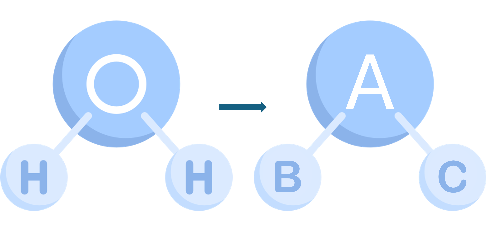

# GNN: Graph Neural Network



Let's start by understanding how a Convolutional GNN works with the example of ```H2O```.
First, represent structural formula to graph using generic nodes ```A, B, C``` for simplicity.

## Adjacency Matrix (A): message passing
The adjacency matrix captures the ```connectivity`` of the graph, including self-connections (nodes connected to themselves).

```
  A B C
A 1 1 1
B 1 1 0
C 1 0 1
```

## Feature Matrix (X): node update
Each node has its own feature. I use ```binary features``` to represent whether the atom is ```Oxygen or Hydrogen```.

```
A 1 0 # oxygen
B 0 1 # hydrogen
C 0 1 # hydrogen
```

## Feature Representation (H)
Calculate the feature representation by **multiplying** the ```adjacency matrix(A)``` and ```feature matrix(X)```.

```
H = A x X

1 1 1       1 0       1 2
1 1 0   x   0 1   =   1 1
1 0 1       0 1       1 1
```

## Pooling
Pooling methods like max-pooling, average-pooling, min-pooling, and sum-pooling are used to condense the node-level features into a graph-level feature vector. Here, i use ```max-pooling```.

```
graph level vector(pooled feature vector) = [1 2]
```

This vector represents the entire graph as a single vector. Then input this vector into fully connected layer to predict the label ```water```
