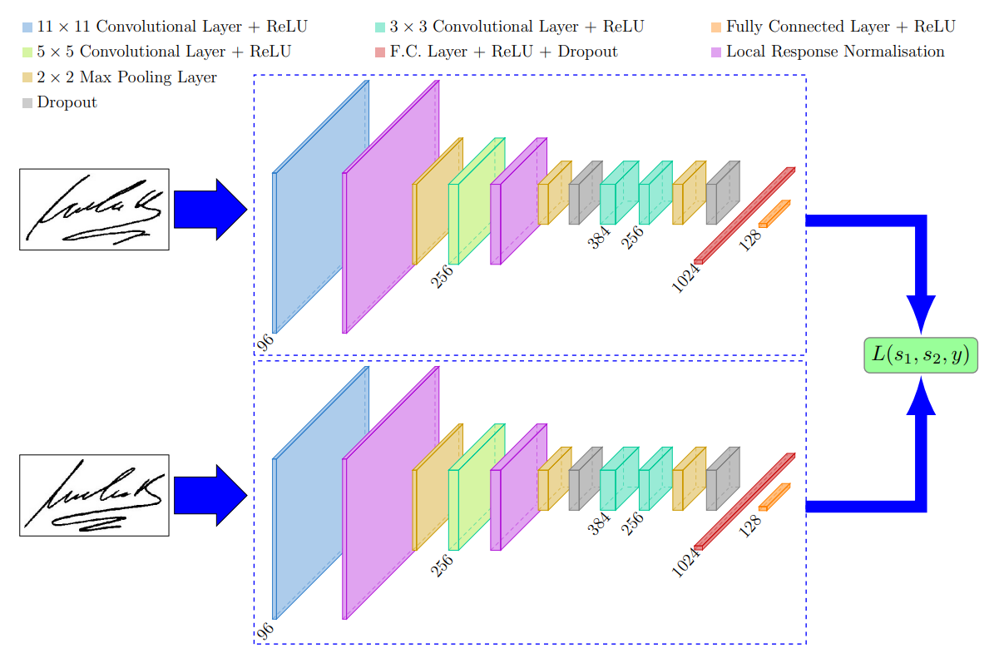
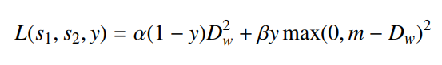

# SNN with SigNet

## Structures

It contain two or more identical sub-networks. “Identical” means they have the same configuration with the same parameters and weights. 
Parameter updating is mirrored across both sub-networks and it’s used to find similarities between inputs by comparing its feature vectors.

## Contrastive Loss

- s1, s2: two sample images
- y: binary indicator function denoting whether the two samples belong to the same class or not
- α, β(1-α): two constants
- m: margin(indicate that dissimilar pairs that are beyond this margin should not contribute to the loss)
- Dw: euclidean distance

Aims to bring the output feature vectors closer for input pairs that are labelled as similar, and push the feature vectors away if the input pairs are dissimilar.

## How to train
1. Initialize the network, loss function and optimizer.
2. Pass the first image of the pair through the network.
3. Pass the second image of the pair through the network.
4. Calculate the loss using the outputs from the first and second images.
5. Backpropagate the loss to calculate the gradients of our model.
6. Update the weights using an optimizer.
7. Save the model.

## Pros and Cons
- Giving a few images per class is sufficient for siamese networks to recognize those images in the future with the aid of one-shot learning.
- Since training involves pairwise learning, SNNs won’t output the probabilities of the prediction, only distance from each class.
