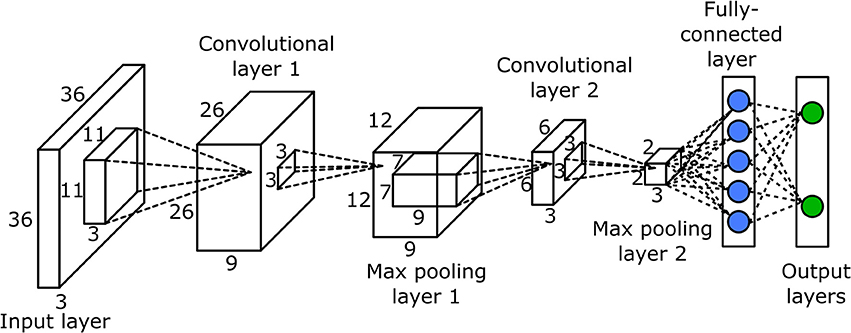

# ConvNet: Convolutional Neural Network

## Structures


### encoder
ConvNets were originally designed for image recognition, but by using the layers up to the fully connected layer as the encoder adapted for segmentation.
3x3, 7x7, and 11x11 kernels were used to achieve a **larger receptive**, because the limitations of computing resources at the time made it difficult to build deep networks.

### decoder
Designed similarly to the **UNet** architecture, consists of transposed convolutional layers (deconvolution layers) which upscale the encoded features back to the original input resolution.

## Code
```
import tensorflow as tf
from tensorflow.keras.models import Model
from tensorflow.keras.layers import Input, Conv2D, MaxPooling2D, Conv2DTranspose, Flatten, Dense, concatenate


class ConvNet:
    def __init__(
            self,
            input_shape,
            num_classes,
    ):
        self.input_shape = input_shape
        self.num_classes = num_classes

    def build_model(self):
        inputs = Input(shape=self.input_shape)

        # Encoder
        l1 = Conv2D(64, (11, 11), activation='relu', padding='same')(inputs)
        p1 = MaxPooling2D((2, 2), padding='same')(l1)

        l2 = Conv2D(128, (3, 3), activation='relu', padding='same')(p1)
        p2 = MaxPooling2D((2, 2), padding='same')(l2)
        
        l3 = Conv2D(256, (7, 7), activation='relu', padding='same')(p2)
        p3 = MaxPooling2D((2, 2), padding='same')(l3)

        l4 = Conv2D(512, (3, 3), activation='relu', padding='same')(p3)
        p4 = MaxPooling2D((2, 2), padding='same')(l4)

        # Decoder
        u1 = Conv2DTranspose(512, (3, 3), strides=(2, 2), padding='same')(p4)
        c1 = concatenate([u1, l4])

        u2 = Conv2DTranspose(256, (7, 7), strides=(2, 2), padding='same')(c1)
        c2 = concatenate([u2, l3])

        u3 = Conv2DTranspose(128, (3, 3), strides=(2, 2), padding='same')(c2)
        c3 = concatenate([u3, l2])

        u4 = Conv2DTranspose(64, (11, 11), strides=(2, 2), padding='same')(c3)
        c4 = concatenate([u4, l1])

        outputs = Conv2D(self.num_classes, (1, 1), activation='softmax')(u4)

        model = Model(inputs=[inputs], outputs=[outputs])
        return model
```