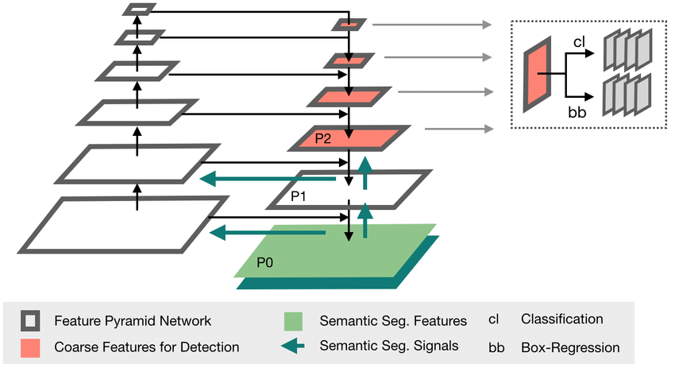
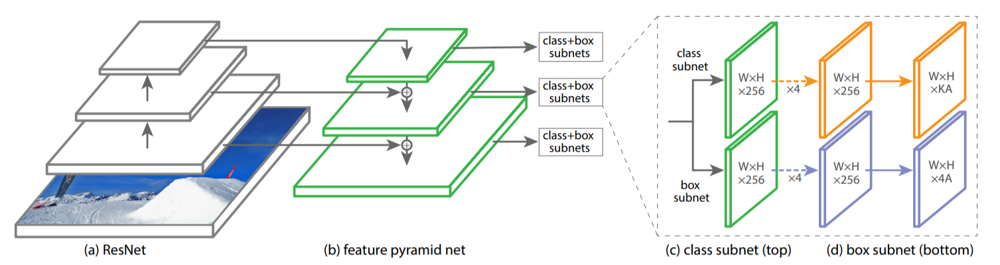

# RetinaUNet

## Structures


The RetinaUNet architecture naturally fuses the Retina Net one-stage detector with the U-Net architecture widely used for semantic segmentation in medical images.

### RetinaNet


RetinaNet(https://doi.org/10.48550/arXiv.1708.02002) is a simple one-stage detector based on a FPN for feature extraction.

## Code
```python
from tensorflow.keras.layers import Conv2D, BatchNormalization, Activation, MaxPool2D, Conv2DTranspose, Concatenate, Input
from tensorflow.keras.models import Model


class RetinaUNet:
    def __init__(
            self,
            input_shape,
            num_classes,
    ):
        self.input_shape = input_shape
        self.num_classes = num_classes

    def build_model(self):
        inputs = Input(self.input_shape)

        s1, p1 = self.encoder_block(inputs, 64)
        s2, p2 = self.encoder_block(p1, 128)
        s3, p3 = self.encoder_block(p2, 256)
        s4, p4 = self.encoder_block(p3, 512)

        b1 = self.conv_block(p4, 1024)

        d1 = self.decoder_block(b1, s4, 512)
        d2 = self.decoder_block(d1, s3, 256)
        d3 = self.decoder_block(d2, s2, 128)
        d4 = self.decoder_block(d3, s1, 64)

        outputs = Conv2D(self.num_classes, (1, 1), activation='softmax')(d4)

        model = Model(inputs=[inputs], outputs=[outputs])
        return model

    def conv_block(self, inputs, num_filters):
        x = Conv2D(num_filters, 3, padding='same')(inputs)
        x = BatchNormalization()(x)
        x = Activation('relu')(x)

        x = Conv2D(num_filters, 3, padding='same')(x)
        x = BatchNormalization()(x)
        x = Activation('relu')(x)
        return x

    def encoder_block(self, inputs, num_filters):
        x = self.conv_block(inputs, num_filters)
        p = MaxPool2D((2, 2))(x)
        return x, p

    def decoder_block(self, inputs, skip_features, num_filters):
        x = Conv2DTranspose(num_filters, (2, 2), strides=2, padding='same')(inputs)
        x = Concatenate()([x, skip_features])
        x = self.conv_block(x, num_filters)
        return x
```
