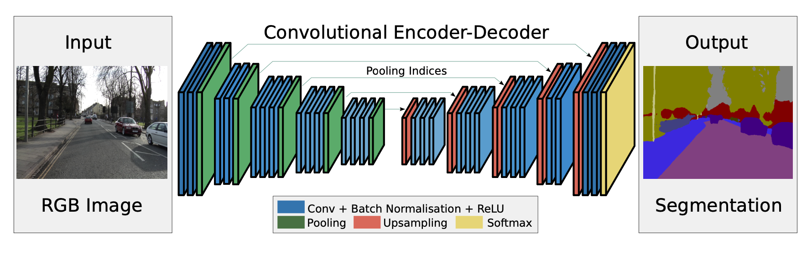
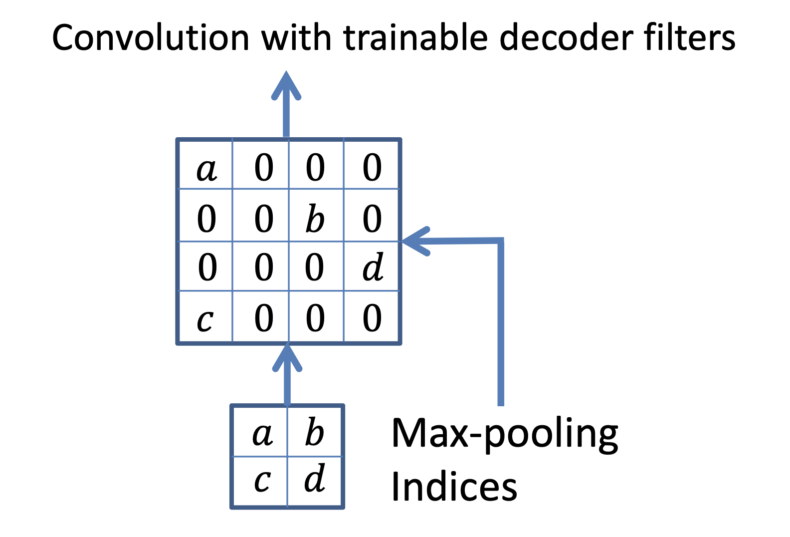

# SegNet: A Deep Convolutional Encoder-Decoder Architecture for Image

## Structures


### encoder
Consists of **13 convolutional layers**, identical to the **VGG16** network's initial layers designed for object classification.
Each encoder layer convolves with a filter bank, applies batch normalization, ReLU activation, and max-pooling with a 2x2 window and stride 2 for sub-sampling.
To maintain boundary information crucial for segmentation, SegNet stores **max-pooling indices** instead of feature maps, enhancing efficiency in memory usage. 

#### max-pooling indices


this is the method that refers to the positions of the maximum elements within each pooling window during the max-pooling operation.

### decoder
Complements the encoder by mapping low-resolution encoder feature maps to full input resolution for **pixel-wise** classification.
It uses pooling indices from the encoder to perform **non-linear upsampling**, eliminating the need to learn upsampling and enhancing boundary delineation.
The final decoder output is fed to a soft-max classifier for pixel-wise classification, making the architecture fully convolutional without fully connected layers. 

## Code
```python
import tensorflow as tf
from tensorflow.keras.models import Model
from tensorflow.keras.layers import Input, Conv2D, Layer, BatchNormalization, Reshape


class MaxPoolingWithArgmax2D(Layer):
    def __init__(self, pool_size=(2, 2), strides=(2, 2), padding="same", **kwargs):
        super(MaxPoolingWithArgmax2D, self).__init__(**kwargs)
        self.pool_size = pool_size
        self.strides = strides
        self.padding = padding.upper()

    def call(self, inputs, **kwargs):
        pool_size = [1, self.pool_size[0], self.pool_size[1], 1]
        strides = [1, self.strides[0], self.strides[1], 1]
        output, argmax = tf.nn.max_pool_with_argmax(
            inputs, ksize=pool_size, strides=strides, padding=self.padding
        )
        argmax = tf.cast(argmax, tf.int32)

        return [output, argmax]

    def compute_output_shape(self, input_shape):
        output_shape = (
            input_shape[0],
            input_shape[1] // self.pool_size[0],
            input_shape[2] // self.pool_size[1],
            input_shape[3]
        )
        return [output_shape, output_shape]

    def compute_mask(self, inputs, mask=None):
        return 2 * [None]


class MaxUnpooling2D(Layer):
    def __init__(self, size=(2, 2), **kwargs):
        super(MaxUnpooling2D, self).__init__(**kwargs)
        self.size = size

    def call(self, inputs, output_shape=None):
        updates, mask = inputs[0], inputs[1]
        mask = tf.cast(mask, tf.int32)
        input_shape = tf.shape(updates, out_type=tf.int32)

        if output_shape is None:
            output_shape = (
                input_shape[0],
                input_shape[1] * self.size[0],
                input_shape[2] * self.size[1],
                input_shape[3],
            )
        self.output_shape1 = output_shape

        one_like_mask = tf.ones_like(mask, dtype=tf.int32)
        batch_shape = tf.concat([[input_shape[0]], [1], [1], [1]], axis=0)
        batch_range = tf.reshape(tf.range(output_shape[0], dtype=tf.int32), shape=batch_shape)
        b = one_like_mask * batch_range
        y = mask // (output_shape[2] * output_shape[3])
        x = (mask // output_shape[3]) % output_shape[2]
        feature_range = tf.range(output_shape[3], dtype=tf.int32)
        f = one_like_mask * feature_range

        updates_size = tf.size(updates)
        indices = tf.transpose(tf.reshape(tf.stack([b, y, x, f]), [4, updates_size]))
        values = tf.reshape(updates, [updates_size])
        ret = tf.scatter_nd(indices, values, output_shape)
        return ret

    def compute_output_shape(self, input_shape):
        mask_shape = input_shape[1]
        return (
            mask_shape[0],
            mask_shape[1] * self.size[0],
            mask_shape[2] * self.size[1],
            mask_shape[3],
        )


class SegNet:
    def __init__(
            self,
            input_shape,
            num_classes,
    ):
        self.input_shape = input_shape
        self.num_classes = num_classes

    def build_model(self):
        inputs = Input(self.input_shape)

        # Encoder
        c1 = self.conv_block_2(inputs, 64, 64)
        p1, mask1 = MaxPoolingWithArgmax2D((2, 2))(c1)

        c2 = self.conv_block_2(p1, 128, 128)
        p2, mask2 = MaxPoolingWithArgmax2D((2, 2))(c2)

        c3 = self.conv_block_3(p2, 256, 256)
        p3, mask3 = MaxPoolingWithArgmax2D((2, 2))(c3)

        c4 = self.conv_block_3(p3, 512, 512)
        p4, mask4 = MaxPoolingWithArgmax2D((2, 2))(c4)

        c5 = self.conv_block_3(p4, 512, 512)
        p5, mask5 = MaxPoolingWithArgmax2D((2, 2))(c5)

        # Decoder
        u6 = MaxUnpooling2D((2, 2))([p5, mask5])
        c6 = self.conv_block_3(u6, 512, 512)

        u7 = MaxUnpooling2D((2, 2))([c6, mask4])
        c7 = self.conv_block_3(u7, 512, 256)

        u8 = MaxUnpooling2D((2, 2))([c7, mask3])
        c8 = self.conv_block_3(u8, 256, 128)

        u9 = MaxUnpooling2D((2, 2))([c8, mask2])
        c9 = self.conv_block_2(u9, 128, 64)

        u10 = MaxUnpooling2D((2, 2))([c9, mask1])
        c10 = self.conv_block_1(u10, 64)
        outputs = Conv2D(self.num_classes, (1, 1), activation='softmax')(c10)

        model = Model(inputs=[inputs], outputs=[outputs])
        return model


    def conv_block_1(self, input_tensor, num_filters):
        x = Conv2D(num_filters, (3, 3), activation='relu', padding='same')(input_tensor)
        x = BatchNormalization()(x)
        return x


    def conv_block_2(self, input_tensor, num_filters_1, num_filters_2):
        x = Conv2D(num_filters_1, (3, 3), activation='relu', padding='same')(input_tensor)
        x = BatchNormalization()(x)
        x = Conv2D(num_filters_2, (3, 3), activation='relu', padding='same')(x)
        x = BatchNormalization()(x)
        return x


    def conv_block_3(self, input_tensor, num_filters_1, num_filters_2):
        x = Conv2D(num_filters_1, (3, 3), activation='relu', padding='same')(input_tensor)
        x = BatchNormalization()(x)
        x = Conv2D(num_filters_1, (3, 3), activation='relu', padding='same')(x)
        x = BatchNormalization()(x)
        x = Conv2D(num_filters_2, (3, 3), activation='relu', padding='same')(x)
        x = BatchNormalization()(x)
        return x
```
