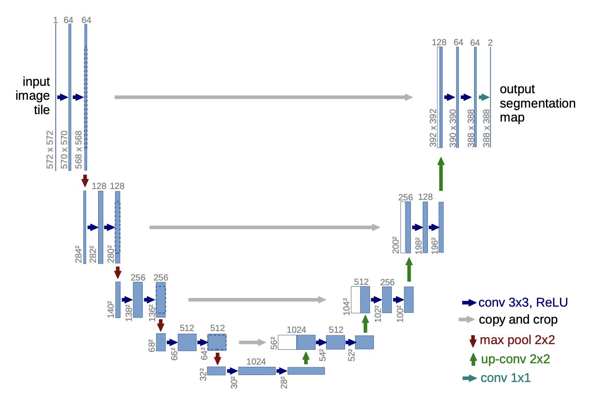

# U-Net: Convolutional Networks for Biomedical Image Segmentation

## Needs
- typical convolutional network &rarr; single label classification
- biomedical &rarr; **each pixel** classification(localization)

### sliding window
```Ciresan, 2012``` suggested to localize the networks, solves a problem using data within a fixed-size window as it moves around.
- network must be run separately for each patch &rarr; slow, redundancy
- trade-off between localization accuracy and the use of context(patch)

## Structures


The UNet architecture is divided into a contracting path(encoder) and an expanding path(decoder), which together form a 'U' shape, that's why it called ```UNet```. 

### encoder
When input image comes as a **grayscale(572x572x1)**, convolution operations are performed twice using 64's 3x3 convolution filters with ReLU activation, followed by 2x2 max pooling. 
This process is repeated, til the image size will be 32x32. 
This part is the encoder and is similar to a general CNN model.
The **bridge(30x30x1024)** is the total set of features and the model is trained to find it. 
But bridges don't have spatial information. 
They have features about the input image, but they don't contain information(spatial) about each pixel. 

### decoder
When encoder ends, after performing convolution operations twice with 3x3 convolution filters and ReLU activation, up-convolutions are used. 
The layer information from the corresponding level in the encoder is **copied and crop** to make the same size used to pass less loss of spatial information. 
This process is repeated until the image is reconstructed to a 388x388x64 shape. 
Finally, a softmax function is applied, resulting in a final output of **388x388x2**. 
Here, the two classes represent whether a pixel is part of a cell or not.

## code
```python
import tensorflow as tf
from tensorflow.keras.models import Model
from tensorflow.keras.layers import Input, Conv2D, MaxPooling2D, concatenate, Conv2DTranspose, BatchNormalization, Activation, Dropout


class UNet:
    def __init__(
            self,
            input_shape,
            num_classes,
    ):
        self.input_shape = input_shape
        self.num_classes = num_classes

    def build_model(self):
        inputs = Input(self.input_shape)

        # Encoder
        c1 = self.conv_block(inputs, 64)
        p1 = MaxPooling2D((2, 2))(c1)
        # p1 = Dropout(0.1)(p1)

        c2 = self.conv_block(p1, 128)
        p2 = MaxPooling2D((2, 2))(c2)
        # p2 = Dropout(0.1)(p2)

        c3 = self.conv_block(p2, 256)
        p3 = MaxPooling2D((2, 2))(c3)
        # p3 = Dropout(0.2)(p3)

        c4 = self.conv_block(p3, 512)
        p4 = MaxPooling2D(pool_size=(2, 2))(c4)
        # p4 = Dropout(0.2)(p4)

        # Bottleneck
        c5 = self.conv_block(p4, 1024)

        # Decoder
        u6 = Conv2DTranspose(512, (2, 2), strides=(2, 2), padding='same')(c5)
        u6 = concatenate([u6, c4])
        # u6 = Dropout(0.2)(u6)
        c6 = self.conv_block(u6, 512)

        u7 = Conv2DTranspose(256, (2, 2), strides=(2, 2), padding='same')(c6)
        u7 = concatenate([u7, c3])
        # u7 = Dropout(0.2)(u7)
        c7 = self.conv_block(u7, 256)

        u8 = Conv2DTranspose(128, (2, 2), strides=(2, 2), padding='same')(c7)
        u8 = concatenate([u8, c2])
        # u8 = Dropout(0.1)(u8)
        c8 = self.conv_block(u8, 128)

        u9 = Conv2DTranspose(64, (2, 2), strides=(2, 2), padding='same')(c8)
        u9 = concatenate([u9, c1])
        # u9 = Dropout(0.1)(u9)
        c9 = self.conv_block(u9, 64)

        outputs = Conv2D(self.num_classes, (1, 1), activation='softmax')(c9)

        model = Model(inputs=[inputs], outputs=[outputs])
        return model

    def conv_block(self, input_tensor, num_filters):
        x = Conv2D(num_filters, (3, 3), activation='relu', padding='same')(input_tensor)
        x = BatchNormalization()(x)
        x = Conv2D(num_filters, (3, 3), activation='relu', padding='same')(x)
        x = BatchNormalization()(x)
        return x
```
