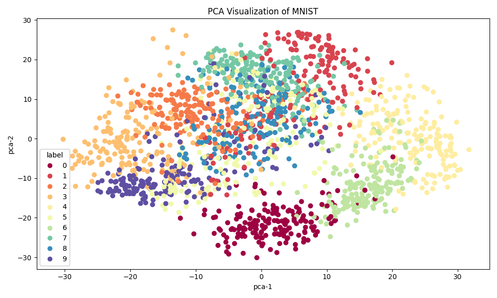
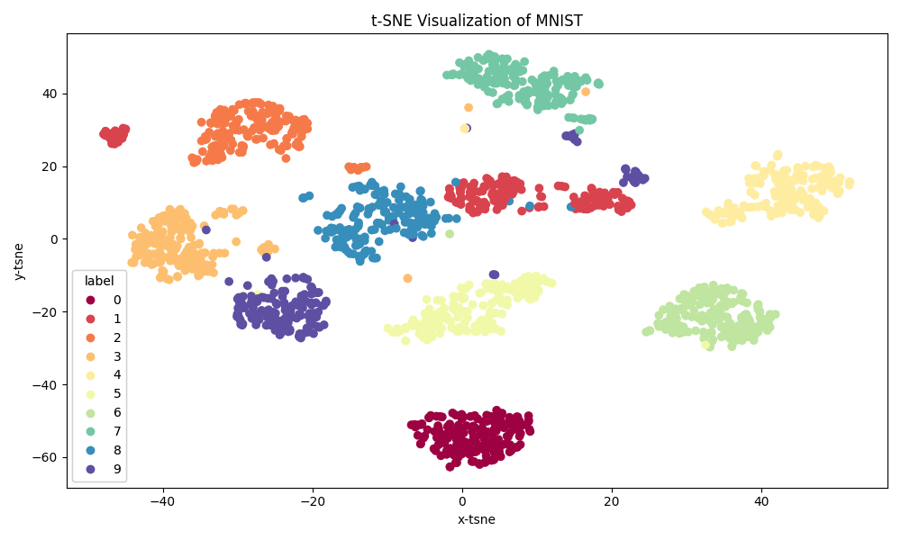
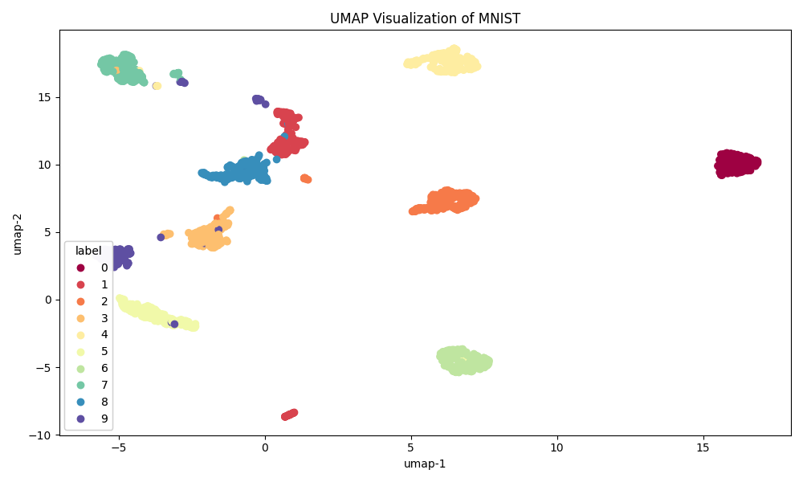

# PCA vs t-SNE vs UMAP

Both methods are used to visualize high-dimensional data in low-dimensional spaces to aid human understanding.

- PCA: collapses dimensions by finding the axis that preserves the most variance in the data.
- t-SNE: based on gaussian distribution(high-dimensional data) and t-distribution(small-dimensional data), make similar this distributions.
- UMAP: based on graph theory, it finds the neighbors of each data point, forms a graph connecting them, and maps this graph in a well-preserved way in low-dimensional space. 

## Visualize






## Code
```
!pip install umap-learn
```

```python
import numpy as np
import matplotlib.pyplot as plt
from sklearn import datasets
from sklearn.manifold import TSNE
from sklearn.decomposition import PCA
import umap

# Data Load (MNIST: 64 dim)
digits = datasets.load_digits()
X = digits.data
y = digits.target

def make_tsne():
    tsne = TSNE(n_components=2, random_state=42)
    X_tsne = tsne.fit_transform(X)

    plt.figure(figsize=(10, 6))
    scatter = plt.scatter(X_tsne[:, 0], X_tsne[:, 1], c=y, cmap='Spectral')

    labels = plt.legend(*scatter.legend_elements(), title='label', loc='lower left')
    plt.gca().add_artist(labels)

    plt.title('t-SNE Visualization of MNIST')
    plt.xlabel('x-tsne')
    plt.ylabel('y-tsne')

    plt.tight_layout()
    plt.savefig('t-SNE.png')

def make_pca():
    pca = PCA(n_components=2)
    X_pca = pca.fit_transform(X)

    plt.figure(figsize=(10, 6))
    scatter = plt.scatter(X_pca[:, 0], X_pca[:, 1], c=y, cmap='Spectral', s=40)

    labels = plt.legend(*scatter.legend_elements(), title='label', loc='lower left')
    plt.gca().add_artist(labels)

    plt.title('PCA Visualization of MNIST')
    plt.xlabel('pca-1')
    plt.ylabel('pca-2')

    plt.tight_layout()
    plt.savefig('PCA.png')

def make_umap():
    reducer = umap.UMAP(random_state=42)
    X_umap = reducer.fit_transform(X)

    plt.figure(figsize=(10, 6))
    scatter = plt.scatter(X_umap[:, 0], X_umap[:, 1], c=y, cmap='Spectral')

    labels = plt.legend(*scatter.legend_elements(), title='label', loc='lower left')
    plt.gca().add_artist(labels)

    plt.title('UMAP Visualization of MNIST')
    plt.xlabel('umap-1')
    plt.ylabel('umap-2')

    plt.tight_layout()
    plt.savefig('UMAP.png')


make_tsne()
make_pca()
make_umap()
```
